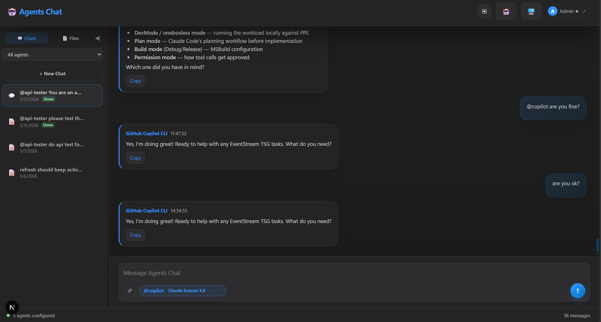
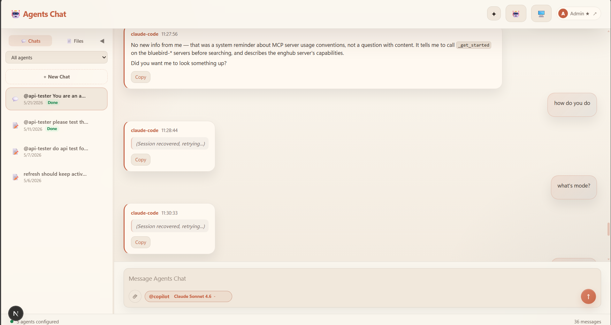

# Agents Chat

A standalone multi-agent chat UI for **ACP (Agent Client Protocol)** agents. Direct communication with ACP-compatible CLI tools — GitHub Copilot CLI, Claude Code, and any ACP-compliant agent.

   

## Prerequisites

- **Node.js** >= 20
- **npm** >= 10
- At least one ACP-compatible agent installed (GitHub Copilot CLI, Claude Code, etc.)

<p align="center">
  
  
</p>

## Quick Start

```bash
npm install
npm run dev          # starts on https://localhost:3010
```

Open [https://localhost:3010](https://localhost:3010).

> **Note:** `npm run dev` enables HTTPS via `--experimental-https`. Accept the self-signed cert on first load.

## Production

```bash
npm run build
npm start            # serves on port 3000
# or
.\start.ps1          # builds + serves with a Dev Tunnel (permanent URL)
.\start.ps1 -Cloudflare  # builds + serves with a Cloudflare quick tunnel
```

### Deployment (Windows Scheduled Task)

For persistent deployment on a Windows machine, use `deploy.ps1` which manages a Scheduled Task that auto-starts the app on login/boot:

```powershell
# Deploy (pulls latest code, restarts the service, waits for readiness)
.\deploy.ps1

# Deploy without git pull
.\deploy.ps1 -SkipGitPull

# Deploy with AtStartup trigger (runs even without login)
.\deploy.ps1 -TaskTriggerType AtStartup -TaskLogonType S4U

# Remove the scheduled task entirely
.\deploy.ps1 -RemoveTask
```

The deploy script:
1. Pulls latest code from git (unless `-SkipGitPull`)
2. Stops the existing Scheduled Task and cleans up port 3000
3. Starts the task (which runs `service-watchdog.ps1` → `start.ps1`)
4. Waits up to 180s for `localhost:3000` to respond

Logs are written to `logs/service-watchdog.log` and `logs/start-service-child.log`.

## Features

- **Multi-agent chat** — Talk to one ACP agent or mention multiple agents in one message.
- **@mention routing** — Type `@agent-id` to target specific agents; messages without mentions go to the currently selected/default agent.
- **Auto agent orchestration** — A scheduler agent decides which agent should act next, evaluates results, and produces a final summary.
- **Discussion orchestration** — Run multiple agents in parallel for configurable rounds, then summarize.
- **Pipeline orchestration** — Run agents sequentially, passing each output to the next.
- **File attachments** — Drag-and-drop or click to attach images and files to messages (up to 8 files, 10 MB each).
- **Files tab** — Browse an agent's working directory (local _or_ remote/relay agents), filter to changed files, open files inline, edit Markdown with split preview or live editing, and save changes back to disk. For relay agents the backend auto-connects the node and resolves `cwd` from the remote machine.
- **Model selection** — Per-agent model picker synced from the agent's available models.
- **Slash commands** — Type `/` in a single-agent chat to pick from the agent's ACP-advertised slash commands (autocomplete dropdown).
- **In-app ACP sign-in** — Agents that require authentication (e.g., Copilot CLI) expose a sign-in flow directly in the UI; the composer surfaces a `needs auth` pill when a turn fails because of missing auth and verifies sign-in actually succeeded.
- **Scheduler / cron jobs** — Schedule any agent to run on a cron expression with per-job run timeout, a themed time picker, and schedule times rendered in the user's local timezone.
- **Environment variables** — Per-agent KEY=VALUE configuration for API keys and agent settings.
- **Themes** — 5 built-in themes (Aurora, Sunset, VS Code Dark, Claude, ChatGPT).
- **Message actions** — Copy (plain), **Copy with format** (rich Markdown→HTML/Markdown, excluding thinking and tool-call DOM), retry, or branch from any message.
- **Mention autocomplete** — Typing `@` filters the agent dropdown as you type.
- **Full screen toggle** — Header button (desktop + mobile) to expand the chat into full screen.
- **Multi-turn queue** — Send follow-up messages while an agent is processing; turns are queued and executed in order.
- **Streaming responses** — Real-time streaming with phase indicators for thinking, tool execution, and replying.
- **Agent management** — Add, configure, remove, and permission agents from the UI. The "last used agent" is persisted per-user on the server.
- **Relay agents** — Connect to remote agents on other machines via Azure Relay.
- **Node registry** — Register and discover remote agent nodes; auto-discovers Azure Relay hybrid connections. The Node Setup Kit lets you choose the launcher (Copilot CLI or Agency).
- **Chat history** — Persistent message history in SQLite (`.data/chats.db`) with sidebar run status, sorted newest-first and filtered to the signed-in user.
- **Session resume** — Reloading a chat restores agent session context via `session/load`.
- **Shared chats** — Generate a read-only share link for any conversation, with Open Graph image optimized for Teams previews.
- **Mobile responsive** — Full-featured UI on phones and tablets with swipeable panels and touch-friendly controls.
- **Authentication** — Azure AD SSO, **GitHub OAuth**, or local credentials login; admin/user roles.

## Using the app

### Chat and message routing

1. Select or create a chat from the left **Chats** sidebar.
2. Type a normal message to send it to the default selected agent.
3. Type `@agent-id` to route the message to a specific agent.
4. Mention multiple agents, for example `@frontend @reviewer implement and review this change`, to enable orchestration controls in the composer.

The chat sidebar shows each chat's recent status so you can switch away while a turn is running and still see whether it is `Running`, `Done`, or `Error`.

### Auto agent orchestration

When a message mentions more than one agent, the composer exposes orchestration modes:

- **Auto** — A scheduler agent plans the next step, chooses one of the mentioned agents, waits for its result, then decides whether another agent should run or whether to produce a final summary.
- **Discussion** — All mentioned agents respond in parallel. You can choose the number of discussion rounds. A summary is generated after the final round.
- **Pipeline** — Agents run in the order they were mentioned. Each agent receives the previous agent's output.

Auto mode is useful when the task has conditional flow, such as "ask one agent to implement, then have another test/review depending on the result." The scheduler is routing-only: it should pick agents and write instructions rather than doing project work itself.

### Slash commands

In a chat targeting a single agent, type `/` in the composer to open a dropdown of the agent's ACP-advertised slash commands. Selecting one inserts the command; arguments (if any) can be typed after it. Slash commands are only shown when the chat targets exactly one agent.

### Scheduler (cron jobs)

Any agent can be scheduled to run on a cron expression:

1. Open the agent's settings or the **Scheduler** UI.
2. Pick a cron schedule using the themed picker (times are displayed in your local timezone).
3. Set an optional **per-job run timeout** so a stuck job is cancelled automatically.
4. Save. The job will fire on schedule, run a turn against the agent, and record the result.

### In-app ACP sign-in

Some ACP agents (for example GitHub Copilot CLI) require authentication before they can answer prompts. When an agent reports it needs auth:

- The composer surfaces a **needs auth** pill.
- Open the agent's panel and click **Sign in**. The UI runs the agent's `authenticate` ACP flow and verifies the sign-in actually completed before clearing the pill.

### Files tab

The left sidebar has two tabs: **Chats** and **Files**.

Use **Files** to inspect and edit files from any agent's working directory (local _or_ relay):

1. Open the **Files** tab.
2. Choose an agent from the dropdown. Relay agents are supported — the backend auto-connects the node and resolves the working directory from the remote machine.
3. Browse the file tree. The backend skips heavy/generated folders such as `.git`, `node_modules`, `.next`, `dist`, `build`, and binary/media file extensions.
4. Click a file to open it inline.
5. For Markdown files, choose:
   - **Split** — text editor plus rendered preview.
   - **Live Edit** — editable rendered Markdown.
6. Click **Save** to write changes back to the agent's working directory.

The **Diff / Changed** toggle lists only files changed according to git (`git diff --name-only HEAD` plus untracked files). Files listing no longer has an artificial file-count cap, but it still keeps traversal safety guards such as maximum depth and skipped directories/extensions.

## Configuration

### Environment variables

Copy `.env.example` to `.env.local` and fill in the required values:

```bash
cp .env.example .env.local
```

| Variable | Required | Description |
|----------|----------|-------------|
| `NEXTAUTH_SECRET` | ✅ | Random secret for signing JWTs |
| `NEXTAUTH_URL` | ✅ | Public URL of the app, for example `https://localhost:3010` |
| `AZURE_AD_CLIENT_ID` | Optional | Azure AD / Microsoft Entra app client ID; enables SSO login when set |
| `AZURE_AD_CLIENT_SECRET` | Optional | Azure AD client secret |
| `AZURE_AD_TENANT_ID` | Optional | Tenant ID, default `common` |
| `GITHUB_CLIENT_ID` | Optional | GitHub OAuth app client ID; enables "Sign in with GitHub" when set. Configure the OAuth app's callback URL as `${NEXTAUTH_URL}/api/auth/callback/github`. |
| `GITHUB_CLIENT_SECRET` | Optional | GitHub OAuth client secret |
| `ADMIN_USERNAME` | Optional | Local admin username for credentials login |
| `ADMIN_PASSWORD` | Optional | Local admin password |
| `ADMIN_EMAILS` | Optional | Comma-separated emails granted admin role for Azure AD users |
| `RELAY_SEND_CONNECTION_STRING` | Optional | Azure Relay send connection string; required for relay agents and node probing |
| `RELAY_KEY_VAULT_NAME` | Optional | Key Vault name used when generating the node setup ZIP |
| `RELAY_KEY_VAULT_SECRET_NAME` | Optional | Key Vault secret name used when generating the node setup ZIP |
| `RELAY_SUBSCRIPTION_ID` | Optional | Azure subscription ID used by node setup ZIPs and relay node auto-discovery |
| `RELAY_RESOURCE_GROUP` | Optional | Azure resource group used by node setup ZIPs and relay node auto-discovery |
| `RELAY_NAMESPACE` | Optional | Azure Relay namespace name |

### Agents

Agents are stored in SQLite (`.data/config.db`) and managed through the UI. On first boot the app auto-migrates any existing `agents.json` file.

#### Add a local/server agent from the UI

1. Open the right **Agents** panel.
2. Click **+**.
3. Choose **Add Agent in Server**. This option is admin-only because it starts a process on the app server.
4. Fill in:
   - **Agent ID** — unique lowercase identifier, used for `@mentions`.
   - **Display Name** — human-friendly name in the UI.
   - **Command** — ACP-compatible executable, for example `copilot.exe`, or an absolute path.
   - **Arguments** — space-separated arguments, commonly `--acp`.
   - **Working Directory** — project folder where the agent should run.
   - **YOLO mode** — auto-approve mode; the backend appends the relevant yolo flag where supported.
5. Click **Create Agent**.

#### Add a GitHub Copilot CLI agent

1. Open the right **Agents** panel → **+** → **Add Agent in Server**.
2. Fill in:
   - **Agent ID** — e.g. `copilot`
   - **Display Name** — e.g. `GitHub Copilot`
   - **Command** — `copilot.exe` (or full path to the Copilot CLI binary)
   - **Arguments** — `--acp`
   - **Working Directory** — project folder
   - **YOLO mode** — check to auto-approve tool calls
3. Click **Create Agent**.

#### Add a Claude Code agent

Claude Code can be added as an ACP agent using the `@agentclientprotocol/claude-agent-acp` package:

1. Open the right **Agents** panel → **+** → **Add Agent in Server**.
2. Fill in:
   - **Agent ID** — e.g. `claude-code`
   - **Display Name** — e.g. `claude-code`
   - **Command** — `npx`
   - **Arguments** — `@agentclientprotocol/claude-agent-acp@latest`
   - **Working Directory** — project folder where Claude should operate
   - **YOLO mode** — check to auto-approve tool calls
3. Click **Create Agent**.

##### Using with an Anthropic API key

Set the following in the agent's **Environment Variables** textarea (in Settings):

```
ANTHROPIC_API_KEY=sk-ant-...
```

> **Important:** Leave the model picker on the model you set in env after starting the agent. The `ANTHROPIC_MODEL` env var controls which model is used. Selecting a model from the picker will override the env var with an incompatible internal name, causing "model not supported" errors.

#### Other supported ACP agents

Any ACP-compatible tool can be added. Here are common examples:

**Gemini CLI**
```json
{
  "id": "gemini",
  "name": "Gemini CLI",
  "command": "npx",
  "args": ["@google/gemini-cli@latest", "--experimental-acp"],
  "cwd": ""
}
```

**Codex CLI**
```json
{
  "id": "codex",
  "name": "Codex CLI",
  "command": "npx",
  "args": ["@zed-industries/codex-acp@latest"],
  "cwd": ""
}
```

**OpenClaw**
```json
{
  "id": "openclaw",
  "name": "OpenClaw",
  "command": "npx",
  "args": ["openclaw", "acp"],
  "cwd": ""
}
```

**Hermes Agent**
```json
{
  "id": "hermes",
  "name": "Hermes Agent",
  "command": "hermes",
  "args": ["acp"],
  "cwd": ""
}
```

For any `npx`-based agent, set **Command** to `npx` and **Arguments** to the package name + flags.

#### Add a remote/relay agent from the UI

Remote agents run on a registered node and connect through Azure Relay.

Option A — from the **Agents** panel:

1. Open **Agents** → **+** → **Add Agent from Remote Node**.
2. Choose a node.
3. Enter an agent ID, display name, and working directory on that remote machine.
4. Click **Create Remote Agent**.

Option B — from the **Nodes** panel:

1. Open **Nodes**.
2. Click the `＋` action on a node row.
3. Enter an agent ID, display name, and working directory.
4. Click **Create Relay Agent**.

Relay agents are stored with `relay: true` and `relayConnectionName` pointing at the node/hybrid connection.

#### Seed agents with `agents.json`

To seed agents without the UI, create `agents.json` at the project root before first boot:

```json
{
  "agents": [
    {
      "id": "copilot",
      "name": "GitHub Copilot CLI",
      "command": "copilot.exe",
      "args": ["--acp"],
      "cwd": "C:\\work",
      "yolo": true
    }
  ]
}
```

#### Agent fields

| Field | Description |
|-------|-------------|
| `id` | Unique agent identifier used for `@mentions` |
| `name` | Display name |
| `command` | Path to the ACP executable for local/server agents |
| `args` | Command line arguments, default commonly `["--acp"]` |
| `cwd` | Working directory for the agent process |
| `yolo` | Auto-approve mode |
| `noTools` | Disable tool calls; agent responds as chat-only, usually faster |
| `relay` | Connect via Azure Relay WebSocket instead of local process |
| `relayConnectionName` | Azure Relay hybrid connection/node name, required when `relay: true` |
| `env` | Environment variables passed to the agent process (KEY=VALUE per line in UI, JSON object in `agents.json`) |
| `public` | Allow all authenticated users to talk to this agent; default is owner-only |

### Nodes

Nodes represent remote machines that can host relay agents. A node is backed by an Azure Relay hybrid connection.

#### Add a node with the setup kit

1. Configure Azure Relay variables in `.env.local` or deployment app settings:
   - `RELAY_SEND_CONNECTION_STRING` for server-side relay connections and node probing.
   - optionally `RELAY_KEY_VAULT_NAME` and `RELAY_KEY_VAULT_SECRET_NAME`; these values are embedded into newly downloaded setup ZIPs so the remote node can fetch `RELAY_CONNECTION_STRING` from Key Vault.
   - optionally `RELAY_SUBSCRIPTION_ID` and `RELAY_RESOURCE_GROUP`; these values are embedded into newly downloaded setup ZIPs so the remote node can create/update/delete its Hybrid Connection.
   - optionally `RELAY_NAMESPACE` for auto-discovery.
   Restart or redeploy the app and download a new `copilot-node-setup.zip` after changing these environment variables.
2. Open the **Nodes** panel.
3. Click **+** to open **Node Setup Kit**.
4. Choose the launcher you want the node to run (**Copilot CLI** or **Agency**) and download `copilot-node-setup.zip`.
5. Copy/extract it on the remote devbox.
6. Open PowerShell in the extracted folder.
7. Run:

```powershell
.\setup-node.ps1
```

The kit includes `setup-node.ps1` and `relay-listener.js`. Prerequisites shown in the UI are Node.js, GitHub Copilot CLI, and Azure CLI logged in. After setup, the node appears in the **Nodes** panel automatically when discovery is configured.

#### Manage nodes

- Click **↻** in the Nodes panel to refresh node status.
- Click a node row to probe/refresh that node.
- Online nodes show a filled status dot.
- Double-click a node name to rename it when you have permission.
- Click `＋` on a node row to create a relay agent on that node.
- Click `✕` on a node row to remove a node you can modify.

## Architecture

- **Frontend**: Next.js 16 (App Router), React 19, CSS modules + styled-jsx, react-markdown.
- **Backend**: Next.js API routes managing ACP agent processes, relay WebSockets, chat persistence, file browsing, config, and auth.
- **Protocol**: NDJSON-RPC over stdio for local agents; WebSocket for relay agents.
- **Storage**: SQLite via better-sqlite3 — `.data/chats.db` for chat history and shared chats, `.data/config.db` for agent/node config.
- **Auth**: NextAuth.js with Azure AD SSO or local credentials providers.

## ACP Protocol Flow

1. **Spawn/connect** — Start a local agent process with configured command + args, or connect to a relay node via Azure Relay.
2. **Initialize** — Send `initialize` with `protocolVersion: 1`.
3. **New Session** — Send `session/new` with working directory and MCP server list.
4. **Prompt** — Send `session/prompt` with the user message.
5. **Stream** — Receive `session/update` notifications for thinking, tool execution, and response chunks.
6. **Complete** — Prompt resolves when the agent finishes; the next queued turn starts automatically.
7. **Resume** — On reconnect, send `session/load` to restore prior session context.

The backend handles server-side requests from agents, including terminal management (`terminal/create`, `terminal/output`, `terminal/wait_for_exit`, etc.) and file system access (`fs/read_text_file`, `fs/write_text_file`).

## Data Migration

If migrating from a legacy JSON-file setup:

```bash
npx tsx lib/migrate.ts
```

## Tests

Tests are Playwright E2E plus lightweight Node regression checks. Playwright expects the app running on `localhost:3010`.

```bash
# Backend/source regression checks
node test/session-mcp-routing.test.mjs
node test/session-prompt-stop-reason.test.mjs
node test/markdown-file-limit.test.mjs

# Type/build checks
npx tsc --noEmit
npm run build

# Playwright E2E
NEXT_PUBLIC_E2E_TESTS=1 npm run dev
PLAYWRIGHT_BASE_URL=https://localhost:3010 NODE_TLS_REJECT_UNAUTHORIZED=0 \
  npx playwright test --config test/playwright.config.ts

# Single spec / single test
npx playwright test --config test/playwright.config.ts test/test-ui.spec.ts
npx playwright test --config test/playwright.config.ts -g "test name"
```

## License

MIT
