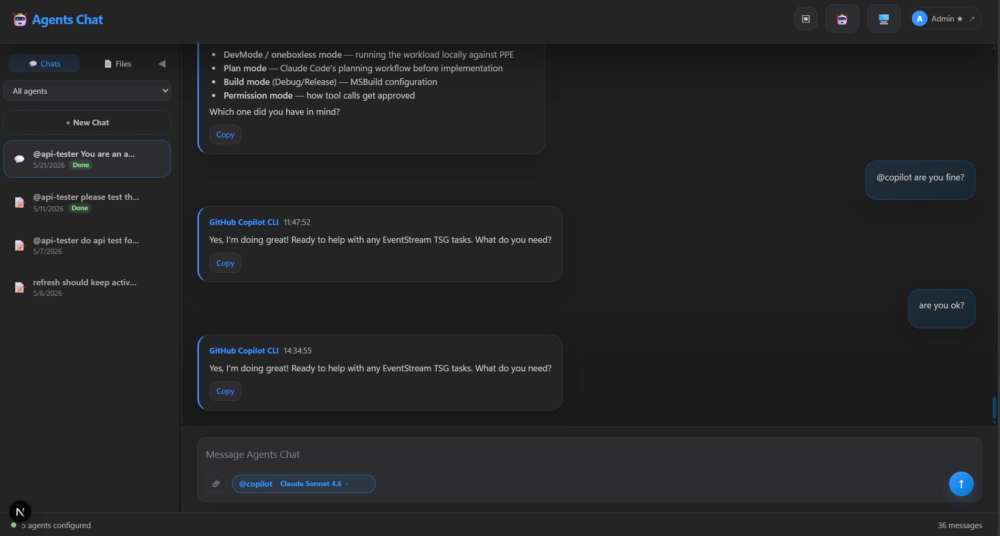
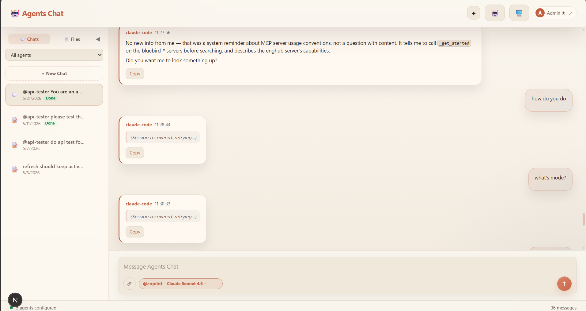

# Agents Chat

A standalone multi-agent chat UI for **ACP (Agent Client Protocol)** agents. Direct communication with ACP-compatible CLI tools — GitHub Copilot CLI, Claude Code, and any ACP-compliant agent.

   

## Prerequisites

- **Node.js** 24.x
- **npm** >= 10
- At least one ACP-compatible agent installed (GitHub Copilot CLI, Claude Code, etc.)

<p align="center">
  
  
</p>

## Quick Start

```bash
npm install
npm run dev          # starts on https://localhost:3010
```

Open [https://localhost:3010](https://localhost:3010).

> **Note:** `npm run dev` enables HTTPS via `--experimental-https`. Accept the self-signed cert on first load.

## Production

Production commands require **Node.js 24**. The guarded scripts validate the
active Node executable, the `better-sqlite3` native addon, the project/storage
paths, and the SQLite databases before changing the service.

### Binary release bundles

GitHub Releases can also publish prebuilt runtime bundles for Windows and Linux. Each release asset contains the Next.js standalone server output, static assets, `public/`, `.env.example`, and startup scripts:

- Linux: `agents-chat-linux-x64.tar.gz`
- Windows: `agents-chat-windows-x64.zip`

Create a release by pushing a tag such as `v0.1.0`:

```bash
git tag -a v0.1.0 -m "v0.1.0"
git push origin v0.1.0
```

The release workflow in `.github/workflows/release.yml` will build both bundles and upload them to the matching GitHub Release draft. After downloading a bundle:

```bash
cp .env.example .env.local
PORT=3010 ./scripts/start-release.sh
```

On Windows:

```powershell
Copy-Item .env.example .env.local
powershell -ExecutionPolicy Bypass -File .\scripts\start-release.ps1
```

### Deployment (Linux systemd)

Run these commands from the project root. The checkout owner becomes the
systemd service user even when the wrapper is invoked with `sudo`.

```bash
# Deploy/update: git pull, npm ci, verified backup, build, restart, health check
sudo ./scripts/deploy.sh

# Deployment options
sudo ./scripts/deploy.sh --no-pull
sudo ./scripts/deploy.sh --no-install
sudo ./scripts/deploy.sh --wait 180

# Restart only: require the existing build, then back up, restart, and check
sudo ./scripts/safe-restart.sh systemd
sudo ./scripts/safe-restart.sh systemd --wait 0  # skip readiness polling
```

The wrapper installs/enables `agents-chat.service`, prevents concurrent guarded
operations, refuses a conflicting PM2 owner, creates a verified pre-stop
backup as the checkout/service user, and checks `GET /api/health/storage` after
restart. Restart-only never builds and requires a non-empty `.next/BUILD_ID`;
run `sudo ./scripts/deploy.sh` if the build is absent.

```bash
sudo systemctl status agents-chat --no-pager
sudo journalctl -u agents-chat -n 100 --no-pager
sudo journalctl -u agents-chat -f
```

The effective systemd port defaults to `3010`. `PORT` in project
`.env.local` overrides the default, then `/etc/agents-chat.env` overrides
`.env.local`. The resolved port is written into the unit and used by the
post-restart health check.

> systemd `EnvironmentFile` syntax supports `KEY=value` and double-quoted
> values, but not shell `export` statements or `${VAR}` interpolation.

```bash
sudo tee /etc/agents-chat.env > /dev/null <<EOF
PORT=8080
LOG_LEVEL=debug
LOG_DIR=/var/log/agents-chat
EOF
sudo ./scripts/safe-restart.sh systemd
```

### Deployment (PM2)

Run PM2 as the checkout owner, not with `sudo`. The safe wrapper supports one
fork-mode `agents-chat` instance only. It validates the current runtime before
changing it, applies the ecosystem file with the validated absolute Node.js 24
executable, explicitly replaces an instance using an old runtime after the
verified backup, performs the storage health check, and only then runs
`pm2 save`. Restart-only requires an existing non-empty `.next/BUILD_ID`; use
the deployment flow to create a new build.

```bash
# Deploy/update: git pull, npm ci, verified backup, build, restart, health
./scripts/safe-restart.sh pm2 --deploy

# Restart only: require the existing build, then back up, restart, and check
./scripts/safe-restart.sh pm2
./scripts/safe-restart.sh pm2 --wait 180
./scripts/safe-restart.sh pm2 --wait 0

pm2 status
pm2 logs agents-chat --lines 100
```

The effective PM2 port defaults to `3010`. `PORT` in `.env.local` overrides
the default, and `PORT` in the process environment overrides `.env.local`:

```bash
PORT=8080 ./scripts/safe-restart.sh pm2
```

The wrapper refuses cluster/multi-instance layouts, an `agents-chat` process
from another checkout, or an active systemd service for this checkout.

### Deployment (Windows Scheduled Task)

Use an **elevated Windows PowerShell** session. Deployment pulls source
(unless skipped), installs locked dependencies, creates a verified backup,
builds, cooperatively stops the owned watchdog/process tree, installs the
Scheduled Task, starts it, and checks storage readiness.

```powershell
# Deploy/update
.\scripts\deploy.ps1
.\scripts\deploy.ps1 -SkipGitPull
.\scripts\deploy.ps1 -TaskTriggerType AtStartup -TaskLogonType S4U
.\scripts\deploy.ps1 -NoWait

# Restart only: reuse the existing build; no git pull, npm ci, or rebuild
.\scripts\safe-restart.ps1
.\scripts\safe-restart.ps1 -WaitSeconds 180
.\scripts\safe-restart.ps1 -NoWait

# Back up safely, stop, and unregister the task
.\scripts\deploy.ps1 -RemoveTask
```

The default task name is `Agents-Chat-Startup`. The effective Windows port
defaults to `3000`; `.env.local` overrides it, and the current process
environment `PORT` overrides `.env.local`. The chosen port is stored in the
task action and used for readiness checks. Restart-only requires an existing
`.next\BUILD_ID`; run `.\scripts\deploy.ps1` if the build is absent.

```powershell
Get-ScheduledTask -TaskName "Agents-Chat-Startup" | Get-ScheduledTaskInfo
Get-Content .\logs\service-watchdog.log -Tail 100
Get-Content .\logs\start-service-child.log -Tail 100
Get-Content .\logs\start-service-child.err.log -Tail 100
```

### Direct-manager fallback limitations

Always prefer `safe-restart.sh`, `safe-restart.ps1`, or the deployment
wrappers. Direct manager commands such as `systemctl restart`, `pm2 reload`,
and `Start-ScheduledTask` are emergency fallbacks **without a guaranteed pre-stop backup**
or the wrapper's manager-conflict and post-start checks.
The managed launchers still run a non-mutating runtime/storage check, so a
bad Node/native-addon/storage state should fail closed, but that is not a
replacement for the verified backup flow.

### Database backups

Each guarded deployment/restart uses SQLite's online backup API, validates the
copies, and publishes one batch under:

```text
.data/backups/<UTC timestamp>-<operation UUID>/
  chats.db
  config.db
  manifest.json
```

Only databases that exist for this installation are included. The latest 10 complete verified batches
are retained; incomplete `.partial` batches do not count. On Linux, backup
directories are restricted to mode `0700` and files to `0600`.

Backups can contain chats and sensitive configuration stored in SQLite. Keep
them private. Sensitive configuration files such as `.env.local` are **not**
included, so back those up separately with equivalent access controls. These
local batches are not off-host disaster recovery: disk or machine loss can
remove both live data and backups. After a batch is complete, securely copy it
and its `manifest.json` to encrypted off-host storage.

List available batches:

```bash
find .data/backups -mindepth 1 -maxdepth 1 -type d ! -name '*.partial' -print | sort
```

```powershell
Get-ChildItem .\.data\backups -Directory |
  Where-Object Name -NotLike '*.partial' |
  Sort-Object Name
```

### Diagnose storage without changing it

Diagnostics validate Node.js 24, the native addon, project root, registered
databases, and SQLite integrity. They do not create a backup or restart a
service.

```bash
npm run diagnose -- --project-root "$PWD" --manager systemd
npm run diagnose -- --project-root "$PWD" --manager pm2
curl -fsS http://localhost:3010/api/health/storage
```

```powershell
node .\scripts\runtime-preflight.mjs diagnose --project-root "$PWD" --manager windows
Invoke-RestMethod http://localhost:3000/api/health/storage
```

Use the effective port described above instead of `3010`/`3000` when
configured. A `503` body containing `storage_unavailable` means the application
could not initialize or query protected storage; preserve `.data`, inspect
manager logs, and run diagnostics.

### Explicit database restore

Restore is intentionally not automatic. **Do not delete or recreate `.data`,
do not copy a live `.db`, and do not restore any batch until the owning service
is stopped and verified stopped.** Select a complete batch directly beneath
`.data/backups`; the restore command rejects other paths, validates the batch,
preserves pre-restore files under `.data/restore-recovery`, and requires an
operation lease plus the explicit `--service-stopped` assertion.

Linux/systemd:

```bash
sudo systemctl stop agents-chat
sudo systemctl is-active agents-chat  # must print inactive
NODE_BIN="$(node -p 'process.execPath')"
sudo "$NODE_BIN" scripts/runtime-preflight.mjs acquire-lease \
  --project-root "$PWD" --owner manual-restore --owner-pid "$$" --manager systemd
# Copy lease.operationId from the JSON output and select a listed batch:
OPERATION_ID='<operation-id>'
BATCH="$PWD/.data/backups/<batch-directory>"
sudo "$NODE_BIN" scripts/restore-databases.mjs --project-root "$PWD" \
  --operation-id "$OPERATION_ID" --from "$BATCH" --service-stopped --manager systemd
sudo "$NODE_BIN" scripts/runtime-preflight.mjs release-lease \
  --project-root "$PWD" --operation-id "$OPERATION_ID"
# The guarded systemd flow creates root-owned backups; return restored DBs to
# the checkout owner used by the unit before starting it.
sudo find .data -maxdepth 1 -type f -name '*.db' -exec chown --reference=. {} +
sudo systemctl start agents-chat
curl -fsS "http://localhost:<effective-port>/api/health/storage"
```

PM2:

```bash
pm2 stop agents-chat
pm2 describe agents-chat  # status must be stopped
node scripts/runtime-preflight.mjs acquire-lease \
  --project-root "$PWD" --owner manual-restore --owner-pid "$$" --manager pm2
OPERATION_ID='<operation-id>'
BATCH="$PWD/.data/backups/<batch-directory>"
node scripts/restore-databases.mjs --project-root "$PWD" \
  --operation-id "$OPERATION_ID" --from "$BATCH" --service-stopped --manager pm2
node scripts/runtime-preflight.mjs release-lease \
  --project-root "$PWD" --operation-id "$OPERATION_ID"
pm2 start agents-chat
curl -fsS "http://localhost:<effective-port>/api/health/storage"
```

Windows Scheduled Task (elevated PowerShell):

```powershell
# This creates a verified backup, cooperatively stops owned processes, and
# unregisters the task. It requires an existing production build.
.\scripts\safe-restart.ps1 -RemoveTask
Get-ScheduledTask -TaskName "Agents-Chat-Startup" -ErrorAction SilentlyContinue
# Confirm no task is returned, then acquire the lease:
$lease = node .\scripts\runtime-preflight.mjs acquire-lease `
  --project-root "$PWD" --owner manual-restore --owner-pid $PID --manager windows |
  ConvertFrom-Json
$batch = (Resolve-Path .\.data\backups\<batch-directory>).Path
node .\scripts\restore-databases.mjs --project-root "$PWD" `
  --operation-id $lease.lease.operationId --from $batch --service-stopped --manager windows
node .\scripts\runtime-preflight.mjs release-lease `
  --project-root "$PWD" --operation-id $lease.lease.operationId
# Reinstall/build/start the task without pulling source:
.\scripts\deploy.ps1 -SkipGitPull
Invoke-RestMethod "http://localhost:<effective-port>/api/health/storage"
```

Release the lease even when restore fails. Do not start the service if restore
reports `recovery-required`; preserve `.data/restore-recovery` and investigate.

### Safe restart troubleshooting

For pre-stop failures, the old service normally remains running and live data
is unchanged. After a manager/start/health failure, inspect the reported
service state; a verified backup path is printed if one was completed.

Use these exact platform commands when a table row calls for status, logs,
diagnose, stop/start, or retry:

| Action | Linux systemd | PM2 | Windows Scheduled Task (elevated) |
|---|---|---|---|
| Status | `sudo systemctl status agents-chat --no-pager` | `pm2 status` | `Get-ScheduledTask -TaskName "Agents-Chat-Startup" \| Get-ScheduledTaskInfo` |
| Logs | `sudo journalctl -u agents-chat -n 100 --no-pager` | `pm2 logs agents-chat --lines 100` | `Get-Content .\logs\service-watchdog.log -Tail 100; Get-Content .\logs\start-service-child.err.log -Tail 100` |
| Diagnose | `npm run diagnose -- --project-root "$PWD" --manager systemd` | `npm run diagnose -- --project-root "$PWD" --manager pm2` | `node .\scripts\runtime-preflight.mjs diagnose --project-root "$PWD" --manager windows` |
| Stop/verify | `sudo systemctl stop agents-chat; sudo systemctl is-active agents-chat` (must be `inactive`) | `pm2 stop agents-chat; pm2 describe agents-chat` (must be `stopped`) | For restore, use `.\scripts\safe-restart.ps1 -RemoveTask`, then confirm `Get-ScheduledTask -TaskName "Agents-Chat-Startup" -ErrorAction SilentlyContinue` returns nothing. |
| Start after restore | `sudo systemctl start agents-chat` | `pm2 start agents-chat` | `.\scripts\deploy.ps1 -SkipGitPull` |
| Retry guarded operation | `sudo ./scripts/safe-restart.sh systemd` | `./scripts/safe-restart.sh pm2` | `.\scripts\safe-restart.ps1` |

| Code | Cause and safety state | Exact next action |
|---|---|---|
| `NODE_VERSION_MISMATCH` | Command is not using Node.js 24; service/data are unchanged. | Activate Node 24, run `node --version`, `npm ci`, then retry the guarded command. |
| `NATIVE_ADDON_INCOMPATIBLE` | `better-sqlite3` cannot load under the active Node/ABI; service/data are unchanged. | Activate Node 24, run `npm ci`, then `npm run diagnose -- --project-root "$PWD" --manager <systemd\|pm2>` (Windows: use `node .\scripts\runtime-preflight.mjs diagnose ... --manager windows`). |
| `INVALID_PROJECT_ROOT` | The resolved directory is not a valid checkout; service/data are unchanged. | `cd` to the project root containing `package.json`, `app`, and `scripts`, then retry. |
| `OPERATION_IN_PROGRESS` | Another guarded process owns `.agents-chat-operation.json`; nothing was restarted. | Wait; inspect the reported PID with `ps -p <PID> -o pid,etime,command` or Windows `Get-Process -Id <PID>`. Never delete a live lease. |
| `DATABASE_MISSING` | A database recorded as expected is absent; no replacement is created. | Verify this checkout and `.data`; list verified backups; stop the owning service before using the explicit restore flow. |
| `DATABASE_INTEGRITY_FAILED` | SQLite `quick_check` or required-schema validation failed; live files are preserved. | Do not migrate/copy files. List backups, stop and verify the service, then explicitly restore a selected verified batch. |
| `DATABASE_BUSY` | SQLite stayed busy through bounded retries; the manager is not changed. | Wait for active work, inspect logs, then retry the same guarded command. |
| `BACKUP_NO_SPACE` | Free space is below the database-size safety margin; no restart occurs. | Free space without deleting live databases or recovery files, then retry. |
| `BACKUP_PERMISSION_DENIED` | `.data/backups` cannot be securely written; no restart occurs. | Linux: `namei -l .data .data/backups`; Windows: `Get-Acl .data; Get-Acl .data\backups`; correct ownership/ACLs and retry. |
| `BACKUP_VALIDATION_FAILED` | A candidate batch, manifest, copy, or retention operation failed validation; live data is unchanged. | Preserve `.data`, inspect manager logs/disk errors, and retry; never use an incomplete or unverified batch. |
| `DEPENDENCY_INSTALL_FAILED` | Deployment `npm ci` failed before service stop. | With Node 24 active, correct the npm error and rerun `sudo ./scripts/deploy.sh` or `.\scripts\deploy.ps1`; PM2 users run `npm ci` then the PM2 wrapper. |
| `BUILD_FAILED` | Production build failed before service stop (Windows restart-only instead reports a missing build). | Fix build output, run `npm run build`, then retry the appropriate guarded deploy/restart command. |
| `MANAGER_CONFLICT` | systemd and PM2, or another checkout, claims `agents-chat`; the wrapper stops neither. | Inspect `systemctl status agents-chat --no-pager; pm2 status`, identify the unintended owner, and stop only that manager. |
| `PORT_IN_USE` | Windows found the effective port owned after the tracked task stopped; no unknown PID is killed. | Run `Get-NetTCPConnection -LocalPort <port>` then inspect its PID with `Get-CimInstance Win32_Process -Filter "ProcessId=<PID>"`; stop/reconfigure only the identified process. |
| `SERVICE_START_FAILED` | The manager could not install/start/reload/persist the service; data is unchanged and a backup usually exists. | systemd: `sudo systemctl status agents-chat --no-pager`; PM2: `pm2 status`; Windows: inspect `Get-ScheduledTask ...`; then read manager logs and retry only after fixing the cause. |
| `STORAGE_HEALTH_FAILED` | Restart began, but `/api/health/storage` did not become healthy; do not assume the old service is still serving. | Inspect logs, safely stop the manager if storage errors continue, run diagnose, and review—not automatically apply—the printed backup. |
| `RESTORE_PRECONDITION_FAILED` | Restore lacked a valid batch/lease or explicit stopped-service confirmation; live data should remain unchanged unless `recovery-required` is reported. | Verify the service is stopped, reacquire a lease, validate the chosen batch, and rerun `restore-databases.mjs` with `--service-stopped`. |
| `UNEXPECTED_ERROR` | An unclassified stage failed; rely on the printed service/data/backup state. | Inspect manager status/logs, run diagnose, preserve `.data`, and retry only after identifying the cause. |

### Logging

The server uses **pino + pino-roll** for structured logs. Defaults:

| Variable | Default | Description |
|---|---|---|
| `LOG_LEVEL` | `info` (prod) / `debug` (dev) | `trace` / `debug` / `info` / `warn` / `error` / `fatal` |
| `LOG_DIR` | `<project>/logs` | Absolute or relative path |
| `LOG_FILE` | `app.log` | Base file name |
| `LOG_ROTATE_FREQUENCY` | `daily` | `daily` / `hourly` / milliseconds |
| `LOG_ROTATE_SIZE` | `10m` | Max size before mid-period rotation |
| `LOG_RETENTION` | `7` | Number of rotated files to keep |

Files written under `$LOG_DIR`:

- `app.<date>.<n>.log` — pino structured JSON (rotated)

Manager logs:

- systemd: `sudo journalctl -u agents-chat -n 100 --no-pager` or
  `sudo journalctl -u agents-chat -f`
- PM2: `pm2 logs agents-chat --lines 100`
- Windows watchdog: `logs/service-watchdog.log`
- Windows child stdout/stderr: `logs/start-service-child.log` and
  `logs/start-service-child.err.log`

## Features

- **Multi-agent chat** — Talk to one ACP agent or mention multiple agents in one message.
- **@mention routing** — Type `@agent-id` to target specific agents; messages without mentions go to the currently selected/default agent.
- **Auto agent orchestration** — A scheduler agent decides which agent should act next, evaluates results, and produces a final summary.
- **Discussion orchestration** — Run multiple agents in parallel for configurable rounds, then summarize.
- **Pipeline orchestration** — Run agents sequentially, passing each output to the next.
- **File attachments** — Drag-and-drop or click to attach images and files to messages (up to 8 files, 10 MB each).
- **Files tab** — Browse an agent's working directory (local _or_ remote/relay agents), filter to changed files, open files inline, edit Markdown with split preview or live editing, and save changes back to disk. For relay agents the backend auto-connects the node and resolves `cwd` from the remote machine.
- **Model selection** — Per-agent model picker synced from the agent's available models.
- **Slash commands** — Type `/` in a single-agent chat to pick from the agent's ACP-advertised slash commands (autocomplete dropdown).
- **In-app ACP sign-in** — Agents that require authentication (e.g., Copilot CLI) expose a sign-in flow directly in the UI; the composer surfaces a `needs auth` pill when a turn fails because of missing auth and verifies sign-in actually succeeded.
- **Scheduler / cron jobs** — Schedule any agent to run on a cron expression with per-job run timeout, a themed time picker, and schedule times rendered in the user's local timezone.
- **Environment variables** — Per-agent KEY=VALUE configuration for API keys and agent settings.
- **Themes** — 5 built-in themes (Aurora, Sunset, VS Code Dark, Claude, ChatGPT).
- **Message actions** — Copy (plain), **Copy with format** (rich Markdown→HTML/Markdown, excluding thinking and tool-call DOM), retry, or branch from any message.
- **Mention autocomplete** — Typing `@` filters the agent dropdown as you type.
- **Full screen toggle** — Header button (desktop + mobile) to expand the chat into full screen.
- **Multi-turn queue** — Send follow-up messages while an agent is processing; turns are queued and executed in order.
- **Streaming responses** — Real-time streaming with phase indicators for thinking, tool execution, and replying.
- **Agent management** — Add, configure, remove, and permission agents from the UI. The "last used agent" is persisted per-user on the server.
- **Relay agents** — Connect to remote agents on other machines via Azure Relay.
- **Node registry** — Register and discover remote agent nodes; auto-discovers Azure Relay hybrid connections. The Node Setup Kit lets you choose the launcher (Copilot CLI or Agency).
- **Chat history** — Persistent message history in SQLite (`.data/chats.db`) with sidebar run status, sorted newest-first and filtered to the signed-in user.
- **Session resume** — Reloading a chat restores agent session context via `session/load`.
- **Shared chats** — Generate a read-only share link for any conversation, with Open Graph image optimized for Teams previews.
- **Mobile responsive** — Full-featured UI on phones and tablets with swipeable panels and touch-friendly controls.
- **Authentication** — Azure AD SSO, **GitHub OAuth**, or local credentials login; admin/user roles.

## Using the app

### Chat and message routing

1. Select or create a chat from the left **Chats** sidebar.
2. Type a normal message to send it to the default selected agent.
3. Type `@agent-id` to route the message to a specific agent.
4. Mention multiple agents, for example `@frontend @reviewer implement and review this change`, to enable orchestration controls in the composer.

The chat sidebar shows each chat's recent status so you can switch away while a turn is running and still see whether it is `Running`, `Done`, or `Error`.

### Auto agent orchestration

When a message mentions more than one agent, the composer exposes orchestration modes:

- **Auto** — A scheduler agent plans the next step, chooses one of the mentioned agents, waits for its result, then decides whether another agent should run or whether to produce a final summary.
- **Discussion** — All mentioned agents respond in parallel. You can choose the number of discussion rounds. A summary is generated after the final round.
- **Pipeline** — Agents run in the order they were mentioned. Each agent receives the previous agent's output.

Auto mode is useful when the task has conditional flow, such as "ask one agent to implement, then have another test/review depending on the result." The scheduler is routing-only: it should pick agents and write instructions rather than doing project work itself.

### Slash commands

In a chat targeting a single agent, type `/` in the composer to open a dropdown of the agent's ACP-advertised slash commands. Selecting one inserts the command; arguments (if any) can be typed after it. Slash commands are only shown when the chat targets exactly one agent.

### Scheduler (cron jobs)

Any agent can be scheduled to run on a cron expression:

1. Open the agent's settings or the **Scheduler** UI.
2. Pick a cron schedule using the themed picker (times are displayed in your local timezone).
3. Set an optional **per-job run timeout** so a stuck job is cancelled automatically.
4. Save. The job will fire on schedule, run a turn against the agent, and record the result.

### In-app ACP sign-in

Some ACP agents (for example GitHub Copilot CLI) require authentication before they can answer prompts. When an agent reports it needs auth:

- The composer surfaces a **needs auth** pill.
- Open the agent's panel and click **Sign in**. The UI runs the agent's `authenticate` ACP flow and verifies the sign-in actually completed before clearing the pill.

### Files tab

The left sidebar has two tabs: **Chats** and **Files**.

Use **Files** to inspect and edit files from any agent's working directory (local _or_ relay):

1. Open the **Files** tab.
2. Choose an agent from the dropdown. Relay agents are supported — the backend auto-connects the node and resolves the working directory from the remote machine.
3. Browse the file tree. The backend skips heavy/generated folders such as `.git`, `node_modules`, `.next`, `dist`, `build`, and binary/media file extensions.
4. Click a file to open it inline.
5. For Markdown files, choose:
   - **Split** — text editor plus rendered preview.
   - **Live Edit** — editable rendered Markdown.
6. Click **Save** to write changes back to the agent's working directory.

The **Diff / Changed** toggle lists only files changed according to git (`git diff --name-only HEAD` plus untracked files). Files listing no longer has an artificial file-count cap, but it still keeps traversal safety guards such as maximum depth and skipped directories/extensions.

## Configuration

### Environment variables

Copy `.env.example` to `.env.local` and fill in the required values:

```bash
cp .env.example .env.local
```

| Variable | Required | Description |
|----------|----------|-------------|
| `NEXTAUTH_SECRET` | ✅ | Random secret for signing JWTs |
| `NEXTAUTH_URL` | ✅ | Public URL of the app, for example `https://localhost:3010` |
| `AZURE_AD_CLIENT_ID` | Optional | Azure AD / Microsoft Entra app client ID; enables SSO login when set |
| `AZURE_AD_CLIENT_SECRET` | Optional | Azure AD client secret |
| `AZURE_AD_TENANT_ID` | Optional | Tenant ID, default `common` |
| `GITHUB_CLIENT_ID` | Optional | GitHub OAuth app client ID; enables "Sign in with GitHub" when set. Configure the OAuth app's callback URL as `${NEXTAUTH_URL}/api/auth/callback/github`. |
| `GITHUB_CLIENT_SECRET` | Optional | GitHub OAuth client secret |
| `ADMIN_USERNAME` | Optional | Local admin username for credentials login |
| `ADMIN_PASSWORD` | Optional | Local admin password |
| `ADMIN_EMAILS` | Optional | Comma-separated emails granted admin role for Azure AD users |
| `RELAY_SEND_CONNECTION_STRING` | Optional | Azure Relay send connection string; required for relay agents and node probing |
| `RELAY_KEY_VAULT_NAME` | Optional | Key Vault name used when generating the node setup ZIP |
| `RELAY_KEY_VAULT_SECRET_NAME` | Optional | Key Vault secret name used when generating the node setup ZIP |
| `RELAY_SUBSCRIPTION_ID` | Optional | Azure subscription ID used by node setup ZIPs and relay node auto-discovery |
| `RELAY_RESOURCE_GROUP` | Optional | Azure resource group used by node setup ZIPs and relay node auto-discovery |
| `RELAY_NAMESPACE` | Optional | Azure Relay namespace name |

### Agents

Agents are stored in SQLite (`.data/config.db`) and managed through the UI. On first boot the app auto-migrates any existing `agents.json` file.

#### Add a local/server agent from the UI

1. Open the right **Agents** panel.
2. Click **+**.
3. Choose **Add Agent in Server**. This option is admin-only because it starts a process on the app server.
4. Fill in:
   - **Agent ID** — unique lowercase identifier, used for `@mentions`.
   - **Display Name** — human-friendly name in the UI.
   - **Command** — ACP-compatible executable, for example `copilot.exe`, or an absolute path.
   - **Arguments** — space-separated arguments, commonly `--acp`.
   - **Working Directory** — project folder where the agent should run.
   - **YOLO mode** — auto-approve mode; the backend appends the relevant yolo flag where supported.
5. Click **Create Agent**.

#### Add a GitHub Copilot CLI agent

1. Open the right **Agents** panel → **+** → **Add Agent in Server**.
2. Fill in:
   - **Agent ID** — e.g. `copilot`
   - **Display Name** — e.g. `GitHub Copilot`
   - **Command** — `copilot.exe` (or full path to the Copilot CLI binary)
   - **Arguments** — `--acp`
   - **Working Directory** — project folder
   - **YOLO mode** — check to auto-approve tool calls
3. Click **Create Agent**.

#### Add a Claude Code agent

Claude Code can be added as an ACP agent using the `@agentclientprotocol/claude-agent-acp` package:

1. Open the right **Agents** panel → **+** → **Add Agent in Server**.
2. Fill in:
   - **Agent ID** — e.g. `claude-code`
   - **Display Name** — e.g. `claude-code`
   - **Command** — `npx`
   - **Arguments** — `@agentclientprotocol/claude-agent-acp@latest`
   - **Working Directory** — project folder where Claude should operate
   - **YOLO mode** — check to auto-approve tool calls
3. Click **Create Agent**.

##### Using with an Anthropic API key

Set the following in the agent's **Environment Variables** textarea (in Settings):

```
ANTHROPIC_API_KEY=sk-ant-...
```

> **Important:** Leave the model picker on the model you set in env after starting the agent. The `ANTHROPIC_MODEL` env var controls which model is used. Selecting a model from the picker will override the env var with an incompatible internal name, causing "model not supported" errors.

#### Other supported ACP agents

Any ACP-compatible tool can be added. Here are common examples:

**Gemini CLI**
```json
{
  "id": "gemini",
  "name": "Gemini CLI",
  "command": "npx",
  "args": ["@google/gemini-cli@latest", "--experimental-acp"],
  "cwd": ""
}
```

**Codex CLI**
```json
{
  "id": "codex",
  "name": "Codex CLI",
  "command": "npx",
  "args": ["@zed-industries/codex-acp@latest"],
  "cwd": ""
}
```

**OpenClaw**
```json
{
  "id": "openclaw",
  "name": "OpenClaw",
  "command": "npx",
  "args": ["openclaw", "acp"],
  "cwd": ""
}
```

**Hermes Agent**
```json
{
  "id": "hermes",
  "name": "Hermes Agent",
  "command": "hermes",
  "args": ["acp"],
  "cwd": ""
}
```

For any `npx`-based agent, set **Command** to `npx` and **Arguments** to the package name + flags.

#### Add a remote/relay agent from the UI

Remote agents run on a registered node and connect through Azure Relay.

Option A — from the **Agents** panel:

1. Open **Agents** → **+** → **Add Agent from Remote Node**.
2. Choose a node.
3. Enter an agent ID, display name, and working directory on that remote machine.
4. Click **Create Remote Agent**.

Option B — from the **Nodes** panel:

1. Open **Nodes**.
2. Click the `＋` action on a node row.
3. Enter an agent ID, display name, and working directory.
4. Click **Create Relay Agent**.

Relay agents are stored with `relay: true` and `relayConnectionName` pointing at the node/hybrid connection.

#### Seed agents with `agents.json`

To seed agents without the UI, create `agents.json` at the project root before first boot:

```json
{
  "agents": [
    {
      "id": "copilot",
      "name": "GitHub Copilot CLI",
      "command": "copilot.exe",
      "args": ["--acp"],
      "cwd": "C:\\work",
      "yolo": true
    }
  ]
}
```

#### Agent fields

| Field | Description |
|-------|-------------|
| `id` | Unique agent identifier used for `@mentions` |
| `name` | Display name |
| `command` | Path to the ACP executable for local/server agents |
| `args` | Command line arguments, default commonly `["--acp"]` |
| `cwd` | Working directory for the agent process |
| `yolo` | Auto-approve mode |
| `noTools` | Disable tool calls; agent responds as chat-only, usually faster |
| `relay` | Connect via Azure Relay WebSocket instead of local process |
| `relayConnectionName` | Azure Relay hybrid connection/node name, required when `relay: true` |
| `env` | Environment variables passed to the agent process (KEY=VALUE per line in UI, JSON object in `agents.json`) |
| `public` | Allow all authenticated users to talk to this agent; default is owner-only |

### Nodes

Nodes represent remote machines that can host relay agents. A node is backed by an Azure Relay hybrid connection.

#### Add a node with the setup kit

1. Configure Azure Relay variables in `.env.local` or deployment app settings:
   - `RELAY_SEND_CONNECTION_STRING` for server-side relay connections and node probing.
   - optionally `RELAY_KEY_VAULT_NAME` and `RELAY_KEY_VAULT_SECRET_NAME`; these values are embedded into newly downloaded setup ZIPs so the remote node can fetch `RELAY_CONNECTION_STRING` from Key Vault.
   - optionally `RELAY_SUBSCRIPTION_ID` and `RELAY_RESOURCE_GROUP`; these values are embedded into newly downloaded setup ZIPs so the remote node can create/update/delete its Hybrid Connection.
   - optionally `RELAY_NAMESPACE` for auto-discovery.
   Restart or redeploy the app and download a new `copilot-node-setup.zip` after changing these environment variables.
2. Open the **Nodes** panel.
3. Click **+** to open **Node Setup Kit**.
4. Choose the launcher you want the node to run (**Copilot CLI** or **Agency**) and download `copilot-node-setup.zip`.
5. Copy/extract it on the remote devbox.
6. Open PowerShell in the extracted folder.
7. Run:

```powershell
.\setup-node.ps1
```

The kit includes `setup-node.ps1` and `relay-listener.js`. Prerequisites shown in the UI are Node.js, GitHub Copilot CLI, and Azure CLI logged in. After setup, the node appears in the **Nodes** panel automatically when discovery is configured.

#### Manage nodes

- Click **↻** in the Nodes panel to refresh node status.
- Click a node row to probe/refresh that node.
- Online nodes show a filled status dot.
- Double-click a node name to rename it when you have permission.
- Click `＋` on a node row to create a relay agent on that node.
- Click `✕` on a node row to remove a node you can modify.

## Architecture

- **Frontend**: Next.js 16 (App Router), React 19, CSS modules + styled-jsx, react-markdown.
- **Backend**: Next.js API routes managing ACP agent processes, relay WebSockets, chat persistence, file browsing, config, and auth.
- **Protocol**: NDJSON-RPC over stdio for local agents; WebSocket for relay agents.
- **Storage**: SQLite via better-sqlite3 — `.data/chats.db` for chat history and shared chats, `.data/config.db` for agent/node config.
- **Auth**: NextAuth.js with Azure AD SSO or local credentials providers.

## ACP Protocol Flow

1. **Spawn/connect** — Start a local agent process with configured command + args, or connect to a relay node via Azure Relay.
2. **Initialize** — Send `initialize` with `protocolVersion: 1`.
3. **New Session** — Send `session/new` with working directory and MCP server list.
4. **Prompt** — Send `session/prompt` with the user message.
5. **Stream** — Receive `session/update` notifications for thinking, tool execution, and response chunks.
6. **Complete** — Prompt resolves when the agent finishes; the next queued turn starts automatically.
7. **Resume** — On reconnect, send `session/load` to restore prior session context.

The backend handles server-side requests from agents, including terminal management (`terminal/create`, `terminal/output`, `terminal/wait_for_exit`, etc.) and file system access (`fs/read_text_file`, `fs/write_text_file`).

## Data Migration

If migrating from a legacy JSON-file setup:

```bash
npx tsx lib/migrate.ts
```

## Tests

Tests are Playwright E2E plus lightweight Node regression checks. Playwright expects the app running on `localhost:3010`.

```bash
# Backend/source regression checks
node tests/session-mcp-routing.test.mjs
node tests/session-prompt-stop-reason.test.mjs
node tests/markdown-file-limit.test.mjs

# Type/build checks
npx tsc --noEmit
npm run build

# Playwright E2E
NEXT_PUBLIC_E2E_TESTS=1 npm run dev
PLAYWRIGHT_BASE_URL=https://localhost:3010 NODE_TLS_REJECT_UNAUTHORIZED=0 \
  npx playwright test --config tests/playwright.config.ts

# Single spec / single test
npx playwright test --config tests/playwright.config.ts tests/test-ui.spec.ts
npx playwright test --config tests/playwright.config.ts -g "test name"
```

## License

MIT
